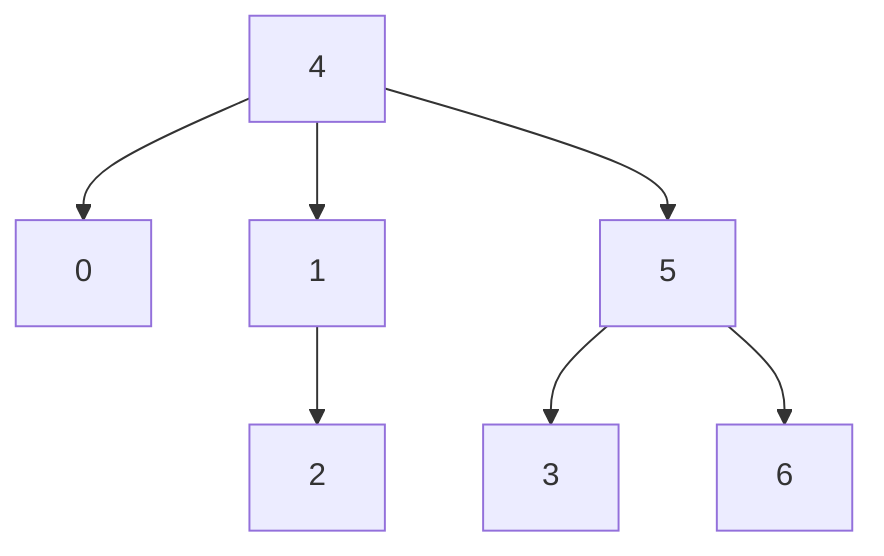

# Calculates the number of internal nodes in a general tree
Run with
```sh
python main.py
```
---

Example:


```mermaid
graph TD;
    5-->3;
    5-->6;
    1-->2;
    4-->1;
    4-->0;
    4-->5
```

Represented by `[4, 4, 1, 5, -1, 4, 5]` has **3** internal nodes.